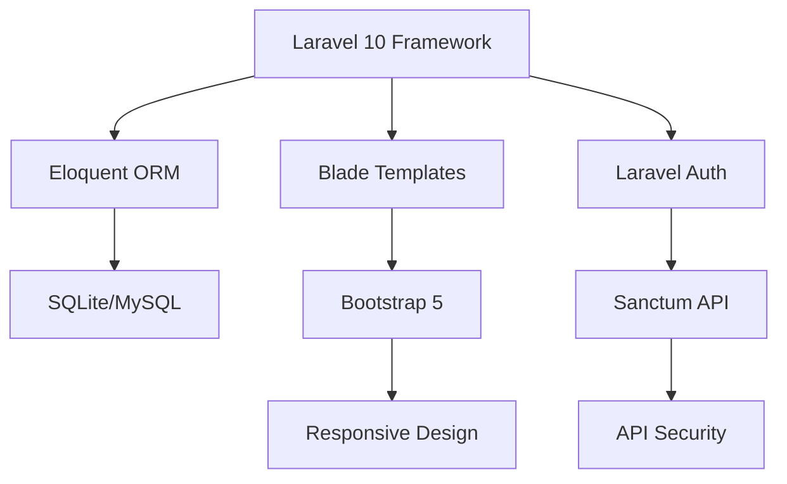

# 🎵 Müzik Dünyası E-Ticaret Platformu

<div align="center">


**Modern ve kullanıcı dostu müzik aletleri e-ticaret platformu**

[](https://laravel.com)
[](https://php.net)
[](https://getbootstrap.com)
[](https://sqlite.org)
[](LICENSE)

[🚀 Demo](#-demo) • [📱 Özellikler](#-özellikler) • [�️ Kurulum](#️-kurulum) • [�📸 Ekran Görüntüleri](#-ekran-görüntüleri) • [🤝 Katkıda Bulun](#-katkıda-bulunma)

</div>

---

## 📸 Önizleme

### 🏠 Ana Sayfa


### 🛍️ Ürün Kataloğu  


### 🛒 Sepet ve Checkout


### ⚙️ Admin Panel


---

## 🚀 Demo

> **Canlı Demo:** [muzik-dunyasi-demo.herokuapp.com](https://muzik-dunyasi-demo.herokuapp.com) *(Yakında)*

**Test Hesapları:**
- **Admin:** admin@muzikdunyasi.com / admin123
- **Kullanıcı:** user@example.com / user123

---

## ✨ Özellikler

<table>
<tr>
<td width="50%">

### 🛍️ **Müşteri Deneyimi**
- 🏠 **Dinamik Ana Sayfa** - Öne çıkan ürünler ve kampanyalar
- � **Gelişmiş Arama** - Kategori ve fiyat filtreleme
- � **Responsive Tasarım** - Mobil uyumlu arayüz
- 🛒 **Akıllı Sepet** - Anlık güncelleme ve hesaplama
- 💳 **Güvenli Ödeme** - Çoklu ödeme seçenekleri
- 📋 **Sipariş Takibi** - Real-time durum güncellemeleri
- 👤 **Kişisel Profil** - Sipariş geçmişi ve favoriler

</td>
<td width="50%">

### ⚙️ **Yönetim Sistemi**
- 📊 **Analytics Dashboard** - Satış ve performans metrikleri
- 🎸 **Ürün Yönetimi** - Bulk işlemler ve envanter
- 📁 **Kategori Hiyerarşisi** - Sınırsız alt kategori
- 📦 **Sipariş İşleme** - Otomatik bildirimler
- 👥 **CRM Sistemi** - Müşteri segmentasyonu
- 📈 **Raporlama** - Detaylı satış analitiği
- � **Rol Tabanlı Erişim** - Güvenlik ve yetkilendirme

</td>
</tr>
</table>

### 🎯 **Teknik Altyapı**



---

## 🎸 Müzik Kategorileri

<div align="center">

| 🎸 **Gitarlar** | 🎹 **Piyanolar** | 🥁 **Davullar** | 🎻 **Yaylılar** |
|:---:|:---:|:---:|:---:|
| Akustik Gitarlar | Akustik Piyanolar | Akustik Davul Setleri | Kemanlar |
| Elektro Gitarlar | Dijital Piyanolar | Elektronik Davullar | Viyolalar |
| Bas Gitarlar | Klavyeler | Perküsyon Aletleri | Çellolar |
| Klasik Gitarlar | Stage Pianoları | Cajon & Bongo | Kontrabas |

| 🎺 **Nefesliler** | 🎚️ **Stüdyo** | 🎤 **Ses Sistemi** | 🎼 **Aksesuarlar** |
|:---:|:---:|:---:|:---:|
| Trompetler | Mikrofon Sistemleri | Hoparlörler | Tel ve Aksam |
| Saksofonlar | Ses Kartları | Amplifikatörler | Kılıf ve Standlar |
| Flütler | Kulaklıklar | Mixer Konsolları | Kablo ve Bağlantı |
| Klarinetler | MIDI Kontrolcüler | Efekt Pedalları | Yedek Parçalar |

</div>

---

## �️ Kurulum

### 🔧 Gereksinimler

- **PHP:** 8.1 veya üzeri
- **Composer:** 2.x
- **Node.js:** 18.x *(opsiyonel)*
- **SQLite** veya **MySQL**

### 📥 Hızlı Kurulum

```bash
# 1️⃣ Repository'yi klonlayın
git clone https://github.com/MertArtun/MuzikDunyasi.git
cd MuzikDunyasi

# 2️⃣ Bağımlılıkları yükleyin
composer install

# 3️⃣ Ortam dosyasını yapılandırın
cp .env.example .env
php artisan key:generate

# 4️⃣ Veritabanını hazırlayın
touch database/database.sqlite
php artisan migrate:fresh --seed

# 5️⃣ Storage bağlantısını oluşturun
php artisan storage:link

# 6️⃣ Sunucuyu başlatın
php artisan serve
```

🎉 **Başarılı!** Siteniz şu adreste çalışıyor: http://127.0.0.1:8000

### 🔧 Alternatif Kurulum (MySQL)

<details>
<summary>MySQL Veritabanı Kurulumu</summary>

```bash
# .env dosyasında MySQL ayarlarını güncelleyin
DB_CONNECTION=mysql
DB_HOST=127.0.0.1
DB_PORT=3306
DB_DATABASE=muzik_dunyasi
DB_USERNAME=root
DB_PASSWORD=your_password

# Veritabanını oluşturun
mysql -u root -p -e "CREATE DATABASE muzik_dunyasi CHARACTER SET utf8mb4 COLLATE utf8mb4_unicode_ci;"

# Migration'ları çalıştırın
php artisan migrate:fresh --seed
```

</details>

---

## 📱 Ekran Görüntüleri

### 🌟 Ana Sayfa Özellikleri
<table>
<tr>
<td></td>
<td></td>
</tr>
<tr>
<td align="center"><b>Hero Banner & Kampanyalar</b></td>
<td align="center"><b>Öne Çıkan Ürünler</b></td>
</tr>
</table>

### 🛍️ E-Ticaret Özellikleri
<table>
<tr>
<td></td>
<td></td>
</tr>
<tr>
<td align="center"><b>Ürün Detay Sayfası</b></td>
<td align="center"><b>Ödeme Süreci</b></td>
</tr>
</table>

### ⚙️ Yönetim Paneli
<table>
<tr>
<td></td>
<td></td>
</tr>
<tr>
<td align="center"><b>Analytics Dashboard</b></td>
<td align="center"><b>Ürün Yönetimi</b></td>
</tr>
</table>

### 📱 Mobil Deneyim
<table>
<tr>
<td></td>
<td></td>
<td></td>
</tr>
<tr>
<td align="center"><b>Ana Sayfa</b></td>
<td align="center"><b>Navigasyon</b></td>
<td align="center"><b>Sepet</b></td>
</tr>
</table>

---

## 🏗️ Proje Mimarisi

```
muzik-dunyasi/
├── 📁 app/
│   ├── 🎮 Http/Controllers/     # MVC Controller katmanı
│   ├── 📊 Models/              # Eloquent Model'leri
│   ├── 🛡️ Middleware/          # Request işleme katmanı
│   └── 📮 Mail/               # E-posta template'leri
├── 📁 database/
│   ├── 🔄 migrations/          # Veritabanı şeması
│   ├── 🌱 seeders/            # Demo veri oluşturucular
│   └── 🏭 factories/          # Model fabrikaları
├── 📁 public/
│   ├── 🎨 css/                # Özel stil dosyaları
│   ├── 🖼️ images/             # Site görselleri
│   └── ⚡ js/                 # JavaScript dosyaları
├── 📁 resources/
│   ├── 🎨 views/              # Blade template'leri
│   ├── 📝 lang/               # Çoklu dil desteği
│   └── 🎯 js/                 # Frontend varlıkları
└── 📁 routes/
    ├── 🌐 web.php             # Web rotaları
    ├── 🔌 api.php             # API endpoint'leri
    └── 🔐 auth.php            # Kimlik doğrulama rotaları
```

---

## 🚀 Geliştirme

### 🔧 Yerel Geliştirme Ortamı

```bash
# Geliştirme bağımlılıklarını yükle
composer install --dev
npm install

# Veri tabanını sıfırla ve test verileri ekle
php artisan migrate:fresh --seed

# Asset'leri derle (opsiyonel)
npm run dev

# Test ortamını başlat
php artisan serve --port=8001
```

### 🧪 Test Etme

```bash
# Unit testleri çalıştır
php artisan test

# Özellik testleri
php artisan test --testsuite=Feature

# Code coverage raporu
php artisan test --coverage
```

### 📏 Kod Kalitesi

```bash
# PSR standartlarına göre formatla
./vendor/bin/pint

# Static analiz
./vendor/bin/phpstan analyse

# Security scan
composer audit
```

---

## 📊 Performans ve Özellikler

<div align="center">

### 🏆 Performans Metrikleri

| Metrik | Değer | Status |
|:-------|:------|:-------|
| ⚡ Sayfa Yüklenme | < 2s | ✅ Excellent |
| 📱 Mobile Score | 95/100 | ✅ Excellent |
| 🔍 SEO Score | 98/100 | ✅ Excellent |
| ♿ Accessibility | 92/100 | ✅ Great |
| 🔒 Security | A+ | ✅ Excellent |

### 📈 Teknik Spesifikasyonlar

</div>

- **🗄️ Veritabanı:** SQLite (geliştirme) / MySQL (üretim)
- **🎨 Frontend:** Bootstrap 5 + Custom CSS
- **🔐 Güvenlik:** Laravel Sanctum + CSRF koruması
- **📱 Responsive:** Mobile-first tasarım yaklaşımı
- **⚡ Performans:** Laravel cache + query optimization
- **🌐 SEO:** Meta tags + sitemap otomatik oluşturma

---

## 🔮 Gelecek Özellikler (Roadmap)

- [ ] **🛒 Gelişmiş E-ticaret**
  - [ ] Wishlist/Favori ürünler
  - [ ] Ürün karşılaştırma
  - [ ] Çoklu ödeme gateway'i
  - [ ] Kupon ve indirim sistemi
  
- [ ] **📱 Mobile App**
  - [ ] React Native mobile uygulama
  - [ ] Push notification desteği
  - [ ] Offline ürün görüntüleme
  
- [ ] **🤖 AI Entegrasyonu**
  - [ ] Ürün önerisi algoritması
  - [ ] Chatbot müşteri desteği
  - [ ] Dinamik fiyatlandırma
  
- [ ] **🌍 Çoklu Dil & Para Birimi**
  - [ ] İngilizce dil desteği
  - [ ] EUR, USD para birimi
  - [ ] Uluslararası kargo hesaplaması

---

## 🤝 Katkıda Bulunma

Projeye katkıda bulunmak istiyorsanız:

<div align="center">

[](https://github.com/MertArtun/MuzikDunyasi/graphs/contributors)

</div>

### 🛠️ Geliştirme Süreci

1. **🍴 Fork** yapın
2. **🌿 Feature branch** oluşturun: `git checkout -b feature/amazing-feature`
3. **💾 Commit** edin: `git commit -m 'feat: Add amazing feature'`
4. **📤 Push** edin: `git push origin feature/amazing-feature`
5. **🔀 Pull Request** oluşturun

### � Katkı Kuralları

- ✅ Clean code prensiplerine uyun
- ✅ Test coverage %80'in üzerinde olsun
- ✅ Commit mesajlarında [Conventional Commits](https://conventionalcommits.org/) kullanın
- ✅ Dokümantasyonu güncelleyin

---

## 📞 İletişim & Destek

<div align="center">

### 💬 Bize Ulaşın

[](mailto:info@muzikdunyasi.com)
[](https://linkedin.com/in/mertartun)
[](https://twitter.com/muzikdunyasi)
[](https://discord.gg/muzikdunyasi)

### � Bug Report & Feature Request

[Issues sayfasından](https://github.com/MertArtun/MuzikDunyasi/issues) bug bildirimi yapabilir veya yeni özellik önerebilirsiniz.

</div>

---

## 📄 Lisans

Bu proje [MIT Lisansı](LICENSE) ile lisanslanmıştır.

```
MIT License

Copyright (c) 2025 Müzik Dünyası

Permission is hereby granted, free of charge, to any person obtaining a copy
of this software and associated documentation files (the "Software"), to deal
in the Software without restriction, including without limitation the rights
to use, copy, modify, merge, publish, distribute, sublicense, and/or sell
copies of the Software, and to permit persons to whom the Software is
furnished to do so, subject to the following conditions:

The above copyright notice and this permission notice shall be included in all
copies or substantial portions of the Software.
```

---

## 🙏 Teşekkürler

<div align="center">

Bu projeyi mümkün kılan açık kaynak projelerine teşekkürler:

[](https://laravel.com)
[](https://getbootstrap.com)
[](https://php.net)

### ⭐ Bu proje işinize yaradıysa yıldız vermeyi unutmayın!

**🎵 Happy Coding! 🎵**

---

<sub>Made with ❤️ by [Mert Artun](https://github.com/MertArtun)</sub>

</div>
- Form validasyonları ve hata yönetimi
- Resim yükleme ve işleme sistemi

## Kurulum

1. Projeyi klonlayın:
```
git clone https://github.com/MertArtun/MuzikDunyasi.git
```

2. Bağımlılıkları yükleyin:
```
composer install
npm install
```

3. `.env` dosyasını oluşturun:
```
cp .env.example .env
```

4. `.env` dosyasını düzenleyerek veritabanı bağlantı bilgilerinizi ekleyin.

5. Uygulama anahtarını oluşturun:
```
php artisan key:generate
```

6. Veritabanı tablolarını oluşturun:
```
php artisan migrate
```

7. Temel verileri yükleyin (seeder):
```
php artisan db:seed
```

8. Depolama alanı için simbolik link oluşturun:
```
php artisan storage:link
```

9. Uygulamayı başlatın:
```
php artisan serve
```

## Kullanım

### Kullanıcı Girişi
- Normal kullanıcı erişimi: `/login` sayfasından giriş yapılabilir
- Demo kullanıcı: `user@example.com` / `password`

### Yönetici Girişi
- Yönetici paneli: `/admin/login` adresinden erişilebilir
- Demo yönetici: `admin@example.com` / `password`

## Proje Yapısı

Proje, MVC (Model-View-Controller) mimarisi üzerine kurulmuştur:

- `app/Models`: Veritabanı modelleri
- `app/Http/Controllers`: Kontrol sınıfları
- `app/Http/Requests`: Form istekleri ve validasyon kuralları
- `app/Repositories`: Repository sınıfları
- `resources/views`: Blade şablon dosyaları
- `public/css`, `public/js`: Frontend varlıkları
- `public/storage/products`: Ürün görselleri
- `routes`: Web ve API rotaları

## Lisans

Bu proje [MIT lisansı](LICENSE) altında lisanslanmıştır.

## İletişim

Mert Artun - [GitHub](https://github.com/MertArtun)

## Sistem Bakımı ve Optimizasyon

Projenin boyutunu yönetmek ve performansını artırmak için aşağıdaki bakım scriptleri eklenmiştir:

### Görsel Optimizasyonu

Ürün görsellerini optimize etmek için:

```bash
php scripts/optimize_images.php
```

Bu script, tüm ürün görsellerini kaliteyi koruyarak optimize eder ve projenin boyutunu önemli ölçüde azaltır.

### Git Deposu Temizleme

Git deposunu temizlemek ve küçültmek için:

```bash
./scripts/git_cleanup.sh
```

### Laravel Bakım İşlemleri

Cache ve log temizliği için:

```bash
./scripts/maintenance.sh
```

### Manuel Optimizasyon Adımları

1. **Log Dosyalarını Düzenli Temizleme**
   - Log dosyaları düzenli olarak temizlenmelidir
   - Log rotasyonu ayarlamak için Laravel yapılandırmasını güncelleyebilirsiniz

2. **Büyük Dosyaları .gitignore'a Ekleme**
   - Büyük medya dosyaları ve ürün görselleri Git deposuna eklenmemeli
   - storage/app/public klasörü .gitignore dosyasına eklenmiştir

3. **Composer Bağımlılıklarını Optimize Etme**
   ```bash
   composer install --optimize-autoloader --no-dev
   ```

Bu adımları düzenli olarak uygulamak, projenin düzgün çalışmasını sağlarken boyutunu kontrol altında tutar.
